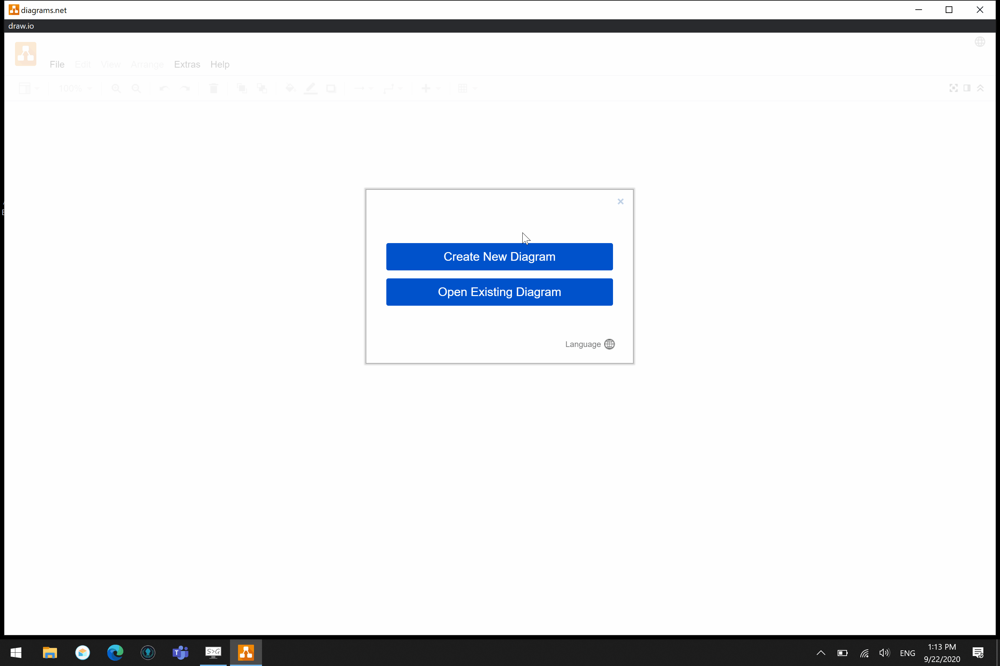

# Databases - Workshops

## Introductie

In deze repository zijn alle workshops van Databases opgenomen, volg de onderstaande links om een workshop te starten.

## Workshops

| Workshop | Onderwerp |
| ----- | ---- |
| [01 - Conceptueel Model](../workshops/01-conceptueel_model/exercises.md) | Leer de basis principes van een conceptueel gegevensmodel. |
| [02 - Zwakke Entiteiten](../workshops/02-zwakke_entiteiten/exercises.md) | Leer zwakke enteiten te modelleren in een ERD. |
| [03 - EERD](../workshops/03-EERD/exercises.md) | Leer een ERD uit te breiden met andere modelleringstechnieken. |
| [04 - Relationeel Model](../workshops/04-relationeel_model/exercises.md) | Leer een conceptueel model over te zetten naar een relationeel model |
| [05 - Normalisatie](../workshops/05-normalisatie/exercises.md) | Leer non-redundante data op te slaan. |
| [06 - Verzamelingenleer](../workshops/06-verzamelingenleer/exercises/exercises.md) | Leer bewerkingen op verzamelingen toe te passen. |
| [07 - SQL](../workshops/07-SQL/exercises.md) | Leer data te raadplegen en manipuleren. |

## Draw.io
Voor het opstellen van de oplossingen werd het programma [draw.io](https://draw.io) gebruikt, er wordt aangeraden om de eerste workshops met pen en papier te tekenen. Nadien, is het *mogelijk* om over te stappen naar het programma.

Standaard werkt draw.io online, maar het is mogelijk om de desktop applicatie te downloaden om offline te kunnen werken. Je kan per operating system, de juiste binary/executable op de volgende link (onderaan de pagina): https://about.draw.io/integrations/ downloaden.

### Quickstart en Templates
1. Download het templates bestand, via [deze link](https://raw.githubusercontent.com/HOGENT-Databases/DB1-Workshops/master/templates/Databases.xml)
2. Ga naar https://www.draw.io/
3. Kies **"Save Diagrams To... Device"**
4. **Create New Diagram**
5. Kies **Basic** (de eerste keuze)
6. Geef een naam voor het eerste diagram in
7. Klik **Create**
8. Verberg alle andere componenten (zoals hieronder in de gif)
9. Ga naar File > **Open Library**
10. Selecteer het templates bestand (Databases.xml)

## Bijdragen en feedback
Voel je vrij om `issues` te openen, `bugs`/`typo's` te verbeteren of **feedback** te geven. Als je meer wilt weten over `Pull Requests`, `Forks` en waarom we ze in deze repository gebruiken, dan kan [dit Medium Artikel](https://zellwk.com/blog/submit-pull-request) je enig inzicht verschaffen.
Extra informatie hoe je dit kan gebruiken aan de hand van de git-commandline en github kan je [hier](https://jarednielsen.com/learn-git-fork-pull-request/) vinden.
