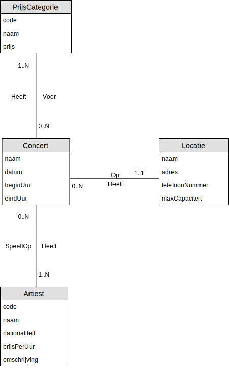

## Oefening 5 - Concerten
Merk op dat:
- "Eens een `concert` afgelopen, wordt het verwijderd uit de Databank"
    - Met andere woorden zijn deze nadien optioneel, dus de **minimum cardinaliteit** is steeds 0
- `Artiesten`, `locaties` en `prijscategorieën` worden niet mee verwijderd 
    - Geen historiek

## Oplossing

## Oefenigen
Klik [hier](../exercises.md) om terug te gaan naar de oefeningen.