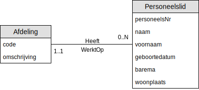

# Oefening 2 - Bedrijf : ERD
Merk op dat:

## Oplossing

## Opmerkingen
- `Leeftijd` geen attribuut is, dit kan berekend worden door de `geboortedatum`
- `Naam` en `Voornaam` afzonderlijk worden opgeslagen.
- `Code` voor de entiteit `Afdeling` komt voort uit de lijst
    - VKP
    - PROD

## Oefeningen
Klik [hier](../exercises.md) om terug te gaan naar de oefeningen.