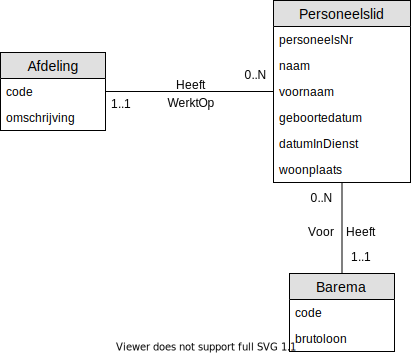

# Oefening 3 - Bedrijf : Loonbarema
Merk op dat:
- `datumInDienst` wordt opgeslagen in plaats van `JarenInDienst`
    - Dezelfde logica van `Leeftijd` en `Geboortedatum` wordt toegepast.
- `Barema` geen attribuut meer is, maar een **entiteitstype** geworden is.
- `Anciënniteitspremie` en `maandloon` zijn procesgegevens
    - Op voorwaarde dat elk personeelslid juist 1 `barema` heeft.

## Oplossing

## Oefeningen
Klik [hier](../exercises.md) om terug te gaan naar de oefeningen.