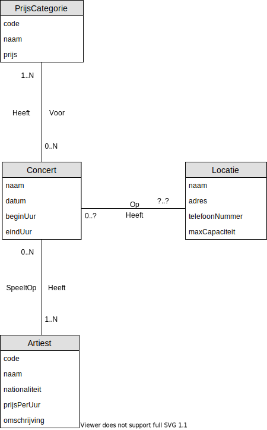

## Oefening 5 - Concerten
Merk op dat:
- "Eens een `concert` afgelopen, wordt het verwijderd uit de Databank"
    - Met andere woorden zijn deze nadien optioneel, dus de **minimum cardinaliteit** is steeds 0
- `Artiesten`, `locaties` en `prijscategorieën` worden niet mee verwijderd 
    - Geen historiek
- De relatie `Locatie` heeft `Concert` kan niet worden bepaald op basis van de gegevens, daarom wordt er `?..?` geplaatst.
    - Met andere woorden moeten we terug naar de opdrachtgever om extra vragen te stellen.

## Oplossing

## Oefeningen
Klik [hier](../exercises.md) om terug te gaan naar de oefeningen.