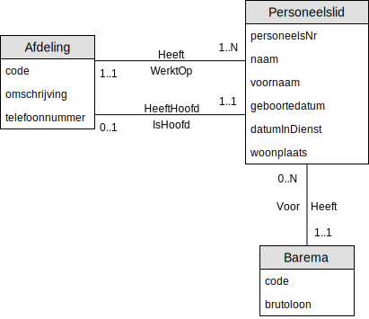

# 02 - Workshop Zwakke Entiteiten

## Oefening 1 - Hotel
Teken het ERD schema op basis van de volgende gegevens.
### Gegeven
#### Enteitstype `Hotel`
- Heeft een uniek attribuut `HotelNr`
    - Bv. 1
- Heeft een attribuut `Naam`
    - Bv. IBIS Hotel
#### Enteitstype `Kamer`
- Heeft een attribuut `KamerNr`
    - Bv. 205
- Heeft een attribuut `Aantalbedden`
    - Bv. 3
#### Relaties `Hotel` - `Kamer`
- Een `hotel` heeft geen of meerdere `kamer`s.
- Een `kamer` heeft steeds een `hotel` waar het toebehoort, daarnaast kan een `kamer` niet zonder een `hotel` bestaan.

### Opdracht
1. Teken de **entiteitstypes**
2. Vul de **attribuuttypes** voor de `entiteitstypes` aan
3. Teken de **relaties** in beide richtingen
4. Teken de **kandidaatsleutel** voor `Hotel`
5. Teken de **kandidaatsleutel** voor `Kamer`
    - Merk op dat een `KamerNr` niet uniek is, waarom?
6. Is `Hotel` een sterk of zwak `entiteitstype`?
7. Is `Kamer` een sterk of zwak `entiteitstype`?
8. Is `Hotel` bestaansafhankelijk van `Kamer`?
8. Is `Kamer` bestaansafhankelijk van `Hotel`?

### Oplossing
Een mogelijke oplossing voor deze oefening vind je [hier](solutions/exercise-1.md)

---

## Oefening 2 - Scholen
Een school heeft een naam, unieke code, daarnaast heeft een school meerdere gebouwen. Een gebouw is verplicht gelinked aan 1 school. Een gebouw heeft een unieke code en een naam. Tot slot heeft een gebouw meerdere lokalen, een lokaal is bestaansafhankelijk van een gebouw. Lokalen hebben steeds een nummer en een aantal plaatsen, uiteraard is het mogelijk dat lokalen in bepaalde gebouwen dezelfde nummer hebben. Denk maar aan de gebouwen op campus Schoonmeersen.

### Opdracht
1. Teken de **entiteitstypes**
2. Vul de **attribuuttypes** voor de `entiteitstypes` aan
3. Teken de **relaties** in beide richtingen
4. Teken de **kandidaatsleutels**
5. Teken de **zwakke entiteiten** op de correcte manier (stippelijn)

### Oplossing
Een mogelijke oplossing voor deze oefening vind je [hier](solutions/exercise-2.md)

---

## Oefening 3 - Bedrijf : Klanten
> Deze oefening werkt verder op de oefening 4 van de workshop [01 - Conceptueel Model](../01-conceptueel_model/exercises.md)

### Vorige keer eindigden we met het volgende schema

Het bedrijf wil naast gegevens over zijn personeel ook informatie over zijn `klanten` bijhouden. ​
Elke `klant` heeft een uniek klantnummer, een naam, adres, telefoon en steeds een contactpersoon in het bedrijf (een personeelslid van de afdeling Verkoop die verantwoordelijk is voor deze klant).

### Voorbeeld
| KlantNr 	| Naam         	| Woonplaats   	| Telefoon     	| Verantwoordelijke 	|
|---------	|--------------	|--------------	|--------------	|-------------------	|
| 1201    	| Meire John   	| Sint-Niklaas 	| 03 771 15 50 	| Janssens Karel    	|
| 1202    	| Jacobs Karel 	| Gent         	| 09 123 45 67 	| De Smet Fien      	|
| 1203    	| Beke Marie   	| Gent         	| 09 235 56 56 	| Janssens Karel    	|
| ...     	| ...          	| ...          	|              	|                   	|

### Opdracht
1. Breid het ERD schema uit.
2. Vul de **attribuuttypes** voor de `entiteitstypes` aan
3. Teken de **relaties** in beide richtingen
4. Teken de **kandidaatsleutels**

### Oplossing
Een mogelijke oplossing voor deze oefening vind je [hier](solutions/exercise-3.md)

---

## Oefening 4 - Bedrijf : Producten
> Deze oefening werkt verder op de vorige oefening (3) van deze workshop.

Het bedrijf bottelt en verkoopt wijn. Zorg dat de producten kunnen opgeslagen worden in de databank. Elke soort wijn krijgt een unieke code, de andere gegevens kan je afleiden uit de onderstaande lijst.

### Producten
| Code 	| Naam van de wijn              	| Jaar 	| Aankoopprijs 	| Voorraad 	|
|------	|-------------------------------	|-----:	|-------------:	|---------:	|
| B01  	| Bordeaux Château Toutigeac    	| 2013 	|         3,61 	|       20 	|
| M05  	| Médoc Château Gravat          	| 2014 	|         5,98 	|      145 	|
| B10  	| Fronsac Château Villars       	| 2014 	|         9,36 	|       60 	|
| A01  	| Pauillac La Chapelle de Bages 	| 2013 	|        12,48 	|       52 	|
| C15  	| Château Bonnet                	| 2014 	|         6,18 	|       87 	|
| ...  	| ...                           	|  ... 	|          ... 	|      ... 	|

Telkens een klant een wijn koopt moet die verkooptransactie bewaard worden in de databank, de voorraad van de verkochte wijn moet automatisch aangepast worden en er moet bijgehouden worden of de klant al dan niet reeds het volledige bedrag betaald heeft (het bedrijf werkt niet met voorschotten).​ De verkoopprijs per kist is normaal gezien de aankoopprijs * 3, maar soms krijgt een klant korting.​ Per klant, per wijn wordt maar één transactie per dag opgenomen in de databank.​

### Opdracht
1. Vertrek van het ERD schema uit de vorige oefening (3)
2. Teken de **entiteitstypes**
3. Vul de **attribuuttypes** voor de `entiteitstypes` aan
4. Teken de **relaties** in beide richtingen
5. Teken de **kandidaatsleutels**
6. Duid de **zwakke entiteitstypes** op de correcte manier aan

### Oplossing
Een mogelijke oplossing voor deze oefening vind je [hier](solutions/exercise-4.md)

---

## Oefening 5 - Concerten : Combi
> Deze oefening werkt verder op de oefening 5 van de workshop [01 - Conceptueel Model](../01-conceptueel_model/exercises.md)

### Vorige keer eindigden we met het volgende schema

Teleticket Service NV verkoopt niet enkel tickets voor éénmalige concerten, maar ook voor meerdaagse festivals (vb rock Werchter, Pukkelpop) of concerten die zich herhalen op verschillende datums (Night of the Proms) met eventueel andere begintijdstippen en eventueel andere prijscategorieën. Het moet mogelijk zijn om de prijs van een combiticket bij te houden alsook aparte prijzen per dag.​ Een concert gaat steeds door op één locatie op minstens 1 dag, daarnaast heeft elke concertdag een oplopende nummering per concert. Tot slot kan één concert meerdere concertdagen hebben met dezelfde of andere artiesten. 
### Opdracht
1. Breid het ERD schema uit.
2. Vul de **attribuuttypes** voor de `entiteitstypes` aan
3. Teken de **relaties** in beide richtingen
4. Teken de **kandidaatsleutels**

### Oplossing
Een mogelijke oplossing voor deze oefening vind je [hier](solutions/exercise-5.md)
