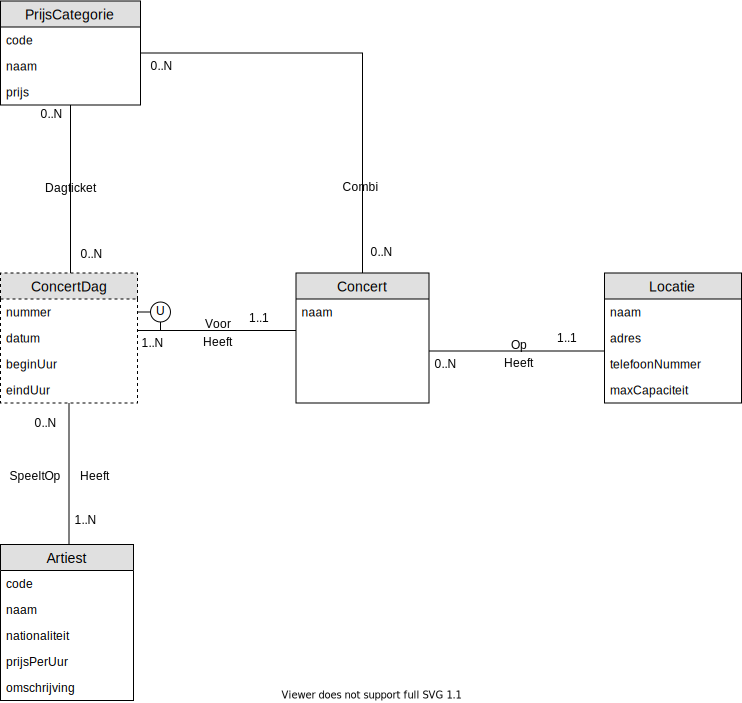

# 02 - Workshop Zwakke Entiteiten

## Oefening 6 - Concerten : Bestellingen
> Deze oefening werkt verder op de oefening 5 van de workshop [02 - Zwakke Entiteiten](../02-zwakke_entiteiten/exercises/exercise-5.md)

### Vorige keer eindigden we met het volgende schema

Teleticket wil ook de verkoop van tickets volledig automatiseren. Klanten kunnen via de website tickets voor een bepaald concert reserveren.​

Ze dienen zich hiervoor aan te melden (uniek userid, naam en paswoord) en kunnen dan het concert, de prijscategorie en het aantal tickets dat ze wensen te reserveren invoeren. Van de klanten houden we ook een adres en het e-mailadres bij.​

Na controle van de beschikbaarheid krijgt de klant per e-mail een bevestiging van de reservatie. Na betaling van het volledige bedrag worden de tickets per post verstuurd naar de klant.

### Opdracht
1. Breid het ERD schema uit.
2. Vul de **attribuuttypes** voor de `entiteittypes` aan
3. Teken de **relaties** in beide richtingen
4. Teken de **kandidaatsleutels**
5. Duid de zwakke entiteiten duidelijk aan

### Oplossing
Een mogelijke oplossing voor deze oefening vind je [hier](../solutions/exercise-6.md)
