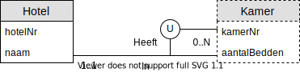

# Oefening 1 - Hotel
## Opmerking
- Het entiteitstype `Kamer` heeft een samengestelde kandidaatsleutel.
    - `KamerNr` en `HotelNr`
- `Kamer` is **bestaansafhankelijk** van `Hotel`, zonder een `Hotel` kan een `Kamer` niet bestaan.
- Een `Hotel` kan bestaan zonder een kamer.
- `Hotel` is een **sterk Entiteitstype** aangezien het zichzelf kan identificeren aan de hand van zijn `HotelNr`.
- `Kamer` is een **zwak Entiteitstype** aangezien het zichzelf **niet** kan identificeren aan de hand van zijn attributen.
    - Een `Kamer` heeft met andere woorden nood aan een `Hotel` om zich te kunnen identificeren.

## Oplossing

## Oefeningen
Klik [hier](../exercises.md) om terug te gaan naar de oefeningen.