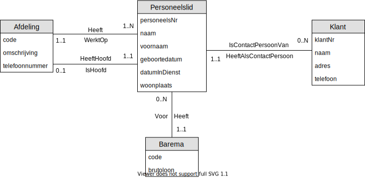

# Oefening 3 - Bedrijf : Klanten
## Oplossing

## Opmerkingen
- Een `personeelslid` kan `contactpersoon` zijn van meerdere `klanten` 
    - Kijk naar de lijst uit de opgave en zie het voorbeeld van Janssens Karel.​
- Enkel `personeelsleden` van de `afdeling` Verkoop zijn `contactpersonen` 
    - minimum cardinaliteit = 0

## Oefenigen
Klik [hier](../exercises.md) om terug te gaan naar de oefeningen.