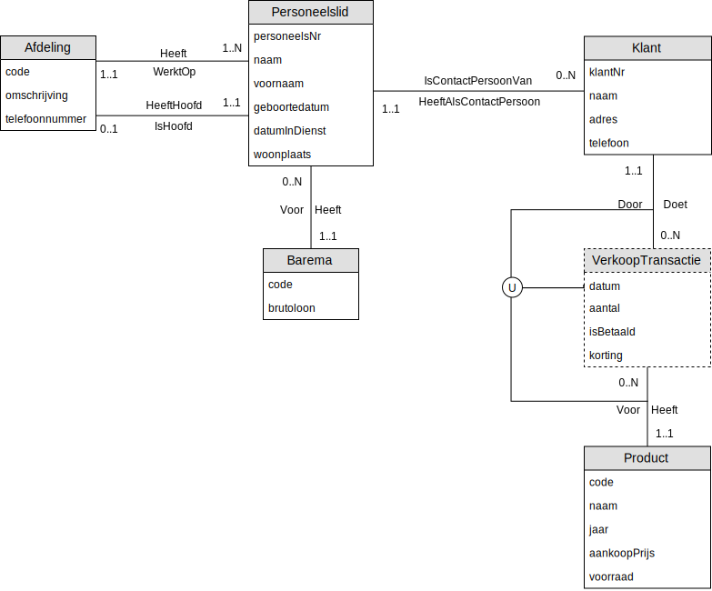

# Oefening 4 - Bedrijf : Producten
## Oplossing

## Opmerkingen
- `VerkoopTransactie` is een zwak **entiteitstype**
    - **Bestaansafhankelijk** van `Klant` en `Product`
    - Kan zichzelf niet **identificeren**
- **Entiteitstype** `Product` kon ook `Wijn` worden genoemd, maar is minder uitbreidbaar naar de toekomst.
- `Korting`/`aantal` kunnen ook worden voorgesteld als een relatie-attribuut tussen `Klant` en `VerkoopTransactie`.

## Oefeningen
Klik [hier](../exercises.md) om terug te gaan naar de oefeningen.