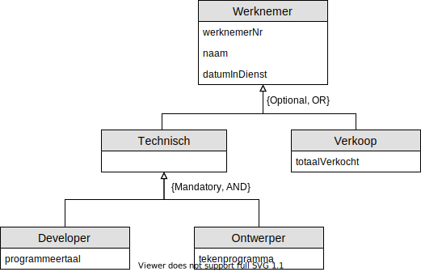

# Oefening 2 - Consultancy

## Oplossing

## Opmerkingen
- Deze oefening toont aan dat een **subtype** ook een **supertype** kan zijn, zo is een `technisch persoon` een **subtype** van `Werknemer` en een **supertype** van de **subtypes** `Developer` en `Ontwerper`.
- **{Optional, OR}**
    - **Optional**
    > - Er zijn echter nog andere mogelijkheden van werknemers zoals administratieve werkkrachten, echter nemen we deze andere types niet op in het schema, maar het moet wel mogelijk zijn deze aan te maken. 
    - **OR**
        > Ervaring leert ons dat technische mensen **nooit** verkopen doen of omgekeerd.
- **{Mandatory, AND}**
    - **Mandatory**
        > Daarnaast zijn technische mensen steeds onderverdeeld in **2 specifieke groepen**...
    - **AND**
        > Het komt wel vaker voor dat `technische ontwerpers` ook `programmeurs` zijn en omgekeerd.
## Oefeningen
Klik [hier](../exercises.md) om terug te gaan naar de oefeningen.