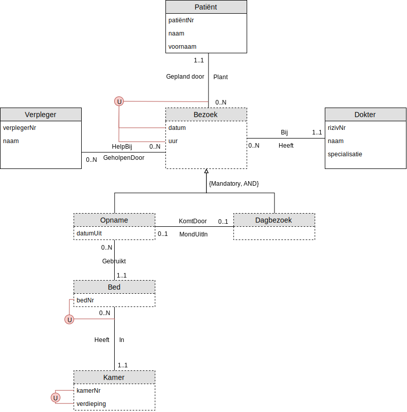

# Oefening 3 - Ziekenhuis

## Oplossing

## Opmerkingen
- Het **entiteittype** `Dagbezoek` heeft geen **attribuuttypes**
    - Dit vanwege het processgegevens zijn, er wordt simpelweg een nieuw `dagbezoek` ingepland.
- `Opname` en `Dagebezoek` zijn een `Bezoek`, dus ook een **zwakke entiteit**
    - Theoretisch: Het **subtype** is een **supertype**, dus ook een **zwakke entiteit**
## Oefeningen
Klik [hier](../exercises.md) om terug te gaan naar de oefeningen.
