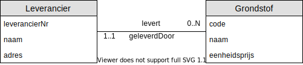

# 04 - Workshop Relationeel Model

## Oefening 1 - 1 op N

In het onderstaande Entity Relationship Diagram (ERD), is te zien dat een `Leverancier` meerdere `Grondstoffen` levert, een `Grondstof` wordt steeds geleverd door 1 `Leverancier`.

### Opdracht
Doorloop het volgende stappenplan om van een conceptueel model over te gaan naar een relationeel model.

1. Elk entiteittype wordt een tupel verzameling of tabel ​
2. Enkelvoudige attribuuttypes overnemen.​
3. Samengestelde attribuuttypes opsplitsen in enkelvoudige attribuuttypes.​
4. Meerwaardige attributen in een aparte, nieuwe verzameling plaatsen.​
5. Primaire sleutel bepalen.​
6. Voor elke relatie (verband) tussen entiteittypes de vreemde sleutel(s) bepalen.​
7. Integriteitregels bepalen van elke vreemde sleutel.​

### Oplossing

Een mogelijke oplossing voor deze oefening vind je [hier](../solutions/exercise-1.md)