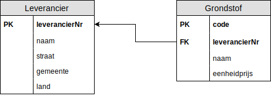

# Oefening 1 - 1 op N

## Oplossing
- Leverancier(<ins>leverancierNr</ins>, naam, straat, huisnr, postcode, gemeente)
- Grondstof(<ins>code</ins>, naam, eenheidsprijs, leverancierNr)
    - IR: leverancierNr verwijst naar de verzameling `Leverancier` en is **verplicht** en **niet-uniek**

## Stappenplan
1. Elk entiteittype wordt een tupel verzameling of tabel ​
    - Leverancier()
    - Grondstof()
2. Enkelvoudige attribuuttypes overnemen.​
    - Leverancier(leverancierNr, naam)
        - De `naam` van de `Leverancier` nemen we over, in dit geval is het de naam van het bedrijf en splitsen we dit niet op.
    - Grondstof(code, naam, eenheidsprijs)
3. Samengestelde attribuuttypes opsplitsen in enkelvoudige attribuuttypes.​
    - Leverancier(leverancierNr, naam, straat, gemeente, land)
        - adres is een samengesteld attribuuttype, dus we splitsen dit op.
    - Grondstof(code, naam, eenheidsprijs)
        - niet van toepassing
4. Meerwaardige attributen in een aparte, nieuwe verzameling plaatsen.​
    - niet van toepassing
5. Primaire sleutel bepalen.​
    - Leverancier(<ins>leverancierNr</ins>, naam, straat, gemeente, land)
    - Grondstof(<ins>code</ins>, naam, eenheidsprijs)
6. Voor elke relatie (verband) tussen entiteittypes de vreemde sleutel(s) bepalen.​
    - Leverancier(<ins>leverancierNr</ins>, naam, straat, gemeente, land)
        - niet van toepassing, de vreemde sleutel of foreign key ligt steeds aan de veel kant
    - Grondstof(<ins>code</ins>, naam, eenheidsprijs, leverancierNr)
7. Integriteitregels bepalen van elke vreemde sleutel.​
    - Leverancier(<ins>leverancierNr</ins>, naam, straat, gemeente, land)
    - Grondstof(<ins>code</ins>, naam, eenheidsprijs, leverancierNr)
        - IR: leverancierNr verwijst naar de verzameling `Leverancier` en is **verplicht**
            - Verplicht vanwege de minimumcardinaliteit.

## Schematisch Alternatief

## Oefeningen
Klik [hier](../exercises.md) om terug te gaan naar de oefeningen.
