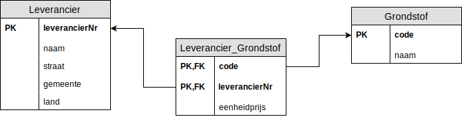

# Oefening 2 - N op N

## Oplossing
1. Elk entiteittype wordt een tupel verzameling of tabel ​
    - Leverancier()
    - Grondstof()
2. Enkelvoudige attribuuttypes overnemen.​
    - Leverancier(leverancierNr, naam)
    - Grondstof(code, naam)
3. Samengestelde attribuuttypes opsplitsen in enkelvoudige attribuuttypes.​
    - Leverancier(leverancierNr, naam, straat, gemeente, land)
        - adres is een samengesteld attribuuttype, dus we splitsen dit op.
    - Grondstof(code, naam)
        - niet van toepassing
4. Meerwaardige attributen in een aparte, nieuwe verzameling plaatsen.​
    - niet van toepassing
5. Primaire sleutel bepalen.​
    - Leverancier(<ins>leverancierNr</ins>, naam, straat, gemeente, land)
    - Grondstof(<ins>code</ins>, naam)
6. Voor elke relatie (verband) tussen entiteittypes de vreemde sleutel(s) bepalen.​
    - Leverancier(<ins>leverancierNr</ins>, naam, straat, gemeente, land)
        - niet van toepassing, veel op veel relatie
    - Grondstof(<ins>code</ins>, naam, eenheidsprijs)
        - niet van toepassing, veel op veel relatie
    - Leverancier_Grondstof(<ins>leverancierNr, code</ins>, eenheidsprijs)
        - Regel: - N op N: aparte verzameling met 2 vreemde sleutels​
7. Integriteitregels bepalen van elke vreemde sleutel.​
    - Leverancier_Grondstof(<ins>leverancierNr, code</ins>, eenheidsprijs)
        - IR: leverancierNr verwijst naar de verzameling `Leverancier` en is **verplicht**
            - Verplicht aangezien het deel uit maakt van de primaire sleutel.
        - IR: code verwijst naar de verzameling `Grondstof` en is **verplicht**
            - Verplicht aangezien het deel uit maakt van de primaire sleutel.

## Schematisch Alternatief

## Oefeningen
Klik [hier](../exercises.md) om terug te gaan naar de oefeningen.
