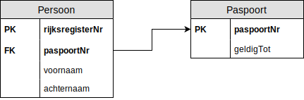
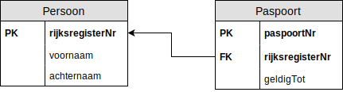

# Oefening 3 - 1 op 1

## Oplossing
- Persoon(<ins>rijksregisterNr</ins>, voornaam, achternaam, paspoortNr)
    - IR: paspoortNr verwijst naar de verzameling `Paspoort` en is **verplicht**, uniek
- Paspoort(<ins>paspoortNr</ins>, geldigTot)

## Stappenplan
1. Elk entiteittype wordt een tupel verzameling of tabel ​
    - Persoon()
    - Paspoort()
2. Enkelvoudige attribuuttypes overnemen.​
    - Persoon(rijksregisterNr)
        - Opgelet, naam kan een samengesteld attribuuttype zijn.
    - Paspoort(paspoortNr, geldigTot)
        - We gaan ervan uit dat `geldigTot` een datum is.
3. Samengestelde attribuuttypes opsplitsen in enkelvoudige attribuuttypes.​
    - Persoon(rijksregisterNr, voornaam, achternaam)
    - Paspoort(paspoortNr, geldigTot)
        - niet van toepassing
4. Meerwaardige attributen in een aparte, nieuwe verzameling plaatsen.​
    - niet van toepassing
5. Primaire sleutel bepalen.​
    - Persoon(<ins>rijksregisterNr</ins>, voornaam, achternaam)
    - Paspoort(<ins>paspoortNr</ins>, geldigTot)
6. Voor elke relatie (verband) tussen entiteittypes de vreemde sleutel(s) bepalen.​
    - Persoon(<ins>rijksregisterNr</ins>, voornaam, achternaam, paspoortNr)
        - Regel: 1 op 1: vreemde sleutel aan 1 zijde (zelf te kiezen).
            - Kan ook in de andere richting opgelost worden.
    - Paspoort(<ins>paspoortNr</ins>, geldigTot)
        - Vreemde sleutel of foreign key ligt reeds bij paspoort, hier hoeven we niets te doen, het is ook mogelijk dit in de andere richting op te lossen.
7. Integriteitregels bepalen van elke vreemde sleutel.​
    - Persoon(<ins>rijksregisterNr</ins>, voornaam, achternaam, paspoortNr)
        - IR: paspoortNr verwijst naar de verzameling `Paspoort` en is **verplicht**
            - Verplicht door de minimumcardinaliteit.

## Schematisch Alternatief

## Schematisch Alternatief a
Het is ook mogelijk de vreemde sleutel aan de andere zijde van de relatie te leggen.

## Oefeningen
Klik [hier](../exercises.md) om terug te gaan naar de oefeningen.
