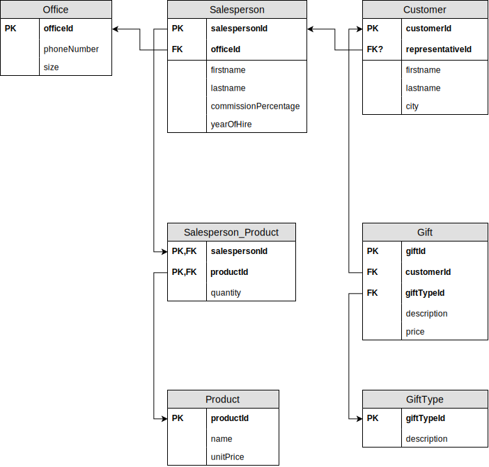

# Oefening 4 - The office

## Oplossing
- Office(<ins>officeId</ins>, phoneNumber, size)
- SalesPerson(<ins>salesPersonId</ins>, firstname, lastname, comissionPercentage, yearOfHire, officeId)
    - IR: officeId verwijst naar de verzameling `Office` en is **verplicht**, uniek
- Customer(<ins>customerId</ins>, firstname, lastname, city, salesPersonId)
    - IR: salesPersonId verwijst naar de verzameling `SalesPerson` en is **optioneel**
- Product_SalesPerson(<ins>productId, salespersonId</ins>, quantity)
    - IR: salesPersonId verwijst naar de verzameling `SalesPerson` en is **verplicht**
    - IR: productId verwijst naar de verzameling `Product` en is **verplicht**
- Gift(<ins>giftId</ins>, description, price, customerId, giftTypeId)
    - IR: customerId verwijst naar de verzameling `Customer` en is **verplicht**
    - IR: giftTypeId verwijst naar de verzameling `GiftType` en is **verplicht**
- GiftType(<ins>giftTypeId</ins>, description)
- Product(<ins>productId</ins>, name, unitPrice)

## Stappenplan
1. Elk entiteittype wordt een tupel verzameling of tabel ​
    - Office()
    - SalesPerson()
    - Customer()
    - Gift
    - GiftType
    - Product
2. Enkelvoudige attribuuttypes overnemen.​
    - Office(officeId, phoneNumber, size)
    - SalesPerson(salesPersonId, name, comissionPercentage, yearOfHire)
    - Customer(customerId, name, city)
    - Gift(giftId, description, price)
    - GiftType(giftTypeId, description)
    - Product(productId, name, unitPrice)
3. Samengestelde attribuuttypes opsplitsen in enkelvoudige attribuuttypes.​
    - Office(officeId, phoneNumber, size)
    - SalesPerson(salesPersonId, firstname, lastname, comissionPercentage, yearOfHire)
    - Customer(customerId, firstname, lastname, city)
    - Gift(giftId, description, price)
    - GiftType(giftTypeId, description)
    - Product(productId, name, unitPrice)
4. Meerwaardige attributen in een aparte, nieuwe verzameling plaatsen.​
    - niet van toepassing
5. Primaire sleutel bepalen.​
    - Office(<ins>officeId</ins>, phoneNumber, size)
    - SalesPerson(<ins>salesPersonId</ins>, firstname, lastname, comissionPercentage, yearOfHire)
    - Customer(<ins>customerId</ins>, firstname, lastname, city)
    - Gift(<ins>giftId</ins>, description, price)
    - GiftType(<ins>giftTypeId</ins>, description)
    - Product(<ins>productId</ins>, name, unitPrice)
6. Voor elke relatie (verband) tussen entiteittypes de vreemde sleutel(s) bepalen.​
    - Office(<ins>officeId</ins>, phoneNumber, size)
    - SalesPerson(<ins>salesPersonId</ins>, firstname, lastname, comissionPercentage, yearOfHire, officeId)
        - Regel: 1 op 1: vreemde sleutel aan 1 zijde, kant van `SalesPerson` omdat er minder NULL waarden zouden zijn.
    - Customer(<ins>customerId</ins>, firstname, lastname, city, salesPersonId)
        - Regel: 1 op N: Steeds de kant van de N-zijde
    - Product_SalesPerson(<ins>productId, salespersonId</ins>, quantity)
        - Regel: N op N: aparte verzameling met 2 vreemde sleutels​
    - Gift(<ins>giftId</ins>, description, price, customerId, giftTypeId)
        - Regels: 1 op N: Steeds de kant van de N-zijde
    - GiftType(<ins>giftTypeId</ins>, description)
    - Product(<ins>productId</ins>, name, unitPrice)
7. Integriteitregels bepalen van elke vreemde sleutel.​
    - Office(<ins>officeId</ins>, phoneNumber, size)
    - SalesPerson(<ins>salesPersonId</ins>, firstname, lastname, comissionPercentage, yearOfHire, officeId)
        - IR: officeId verwijst naar de verzameling `Office` en is **verplicht** + uniek
    - Customer(<ins>customerId</ins>, firstname, lastname, city, salesPersonId)
        - IR: salesPersonId verwijst naar de verzameling `SalesPerson` en is **optioneel**
    - Product_SalesPerson(<ins>productId, salespersonId</ins>, quantity)
        - IR: salesPersonId verwijst naar de verzameling `SalesPerson` en is **verplicht**
        - IR: productId verwijst naar de verzameling `Product` en is **verplicht**
    - Gift(<ins>giftId</ins>, description, price, customerId, giftTypeId)
        - IR: customerId verwijst naar de verzameling `Customer` en is **verplicht**
        - IR: giftTypeId verwijst naar de verzameling `GiftType` en is **verplicht**
    - GiftType(<ins>giftTypeId</ins>, description)
    - Product(<ins>productId</ins>, name, unitPrice)

## Schematisch Alternatief

## Oefeningen
Klik [hier](../exercises.md) om terug te gaan naar de oefeningen.
