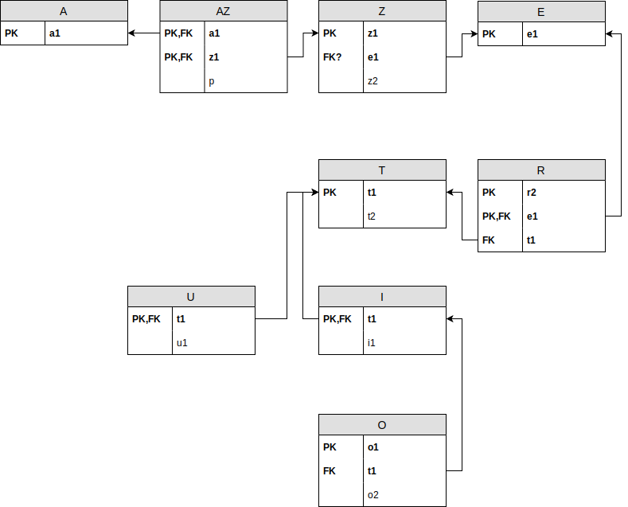

# Oefening 7 - Theoretische benadering

## Opmerkingen
- **VS** staat voor **Vreemde Sleutel** of **Foreign Key**

## Oplossing
- A(<ins>a1</ins>)​
- AZ(<ins>a1,z1</ins>, p) ​
    - a1 VS wijst naar a1 in A; verplicht ​
    - z1 VS wijst naar z1 in Z; verplicht ​
- Z(<ins>z1</ins>,z2,e1)​
    - e1 VS wijst naar e1 in E; optioneel​
- E(<ins>e1</ins>)​
- R(<ins>r2,e1</ins>,t1)​
    - e1 VS wijst naar e1 in E; verplicht​
    - t1 VS wijst naar t1 in T; verplicht​
- T(<ins>t1</ins>,t2)​
- U(<ins>t1</ins>,u1)​
    - t1 VS wijst naar t1 in T; verplicht​
- I(<ins>t1</ins>,i1)​
    - t1 VS wijst naar t1 in T; verplicht​
- O(<ins>o1</ins>,o2, t1)​
    - t1 VS wijst naar t1 in I; verplicht, uniek

## Schematisch Alternatief

## Oefeningen
Klik [hier](../exercises.md) om terug te gaan naar de oefeningen.
