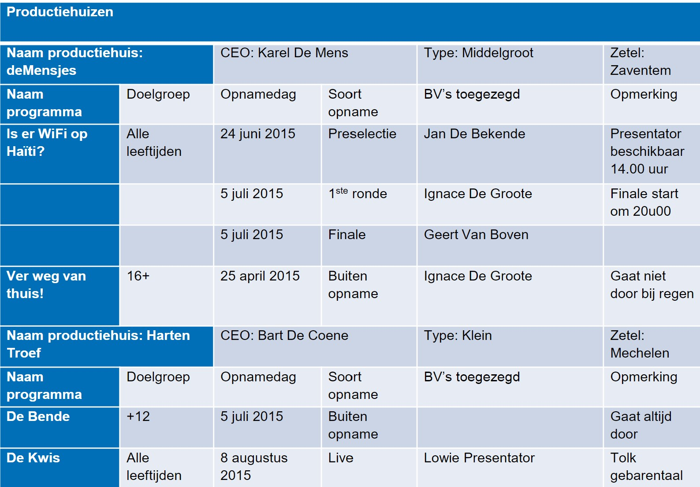

# 05 - Workshop Normalisatie

## Oefening 6 - Productiehuizen
### Voorbeeld Document

### Functionele Afhankelijkheden
- regisseurNr → regisseurNaam, geboorteland, geboortedatum,geboorteplaats
- geboorteplaats  → geboorteland
- filmverdelerNr → filmVerdelerNaam, plaats
- filmverdelerNr, filmID → filmTitel, categorie, regisseurNr,regisseurNaam
- filmverdelerNr, filmID, oscarNr → oscarNaam, winnaarNr
- filmID → filmTitel, categorie, regisseurNr, regisseurNaam
- filmID, oscarNr → oscarNaam, winnaarNr, winnaarNaam
- oscarNr → oscarNaam
- winnaarNr → winnaarNaam

### Bijkomende informatie
- regisseurNaam, winnaarNaam: bestaat uit voornaam en familienaam. 
- Voor elke regisseur is zijn geboorteplaats gekend. 
- De informatie over de gekregen oscarswordt altijd bijgehouden.
- De regisseur van een film is niet altijd gekend.
- Een winnaar van een oscarkan een regisseur zijn, een acteur, ... (een Persoon met een bepaald beroep).
- Per film en oscar is de winnaar altijd ingevuld.
- Er zijn geen procesgegevens aanwezig.

### Model A
- RX1(<ins>filmverdelerNr</ins>, filmverdelerNaam, plaats)
- RX2(<ins>filmverdelerNr, filmID</ins>, filmTitel, categorie,regisseurNr, regisseurVnaam, regisseurFnaam)
- RX3(<ins>filmverdelerNr, filmID, oscarNr</ins>, oscarNaam,winnaarNr, winnaarVnaam, winnaarFnaam)

### Model B
- RX(<ins>regisseurNr</ins>, regisseurVNaam, regisseurFNaam, geboorteland, geboorteplaats, geboortedatum)

### Opdracht
1. Welke van volgende 2 R0-definities is correct? ​
    - A. R0(<ins>productiehuis</ins>, CEO, type, zetel,(programmanaam, doelgroep,(opnamedag, soort opname, BV’s toegezegd, opmerking)\*)\*)​
    - B. R0(<ins>productiehuis</ins>, CEO, type, zetel,(programmanaam, doelgroep)\*, (opnamedag, soort opname, BV’s toegezegd, opmerking)\*)​
2. Geef de 1ste normaalvorm van de door jou ​aangekruiste R0 uit de vorige vraag.
3. Geef aan of volgende functionele afhankelijkheden (FA) kunnen afgeleid worden uit bovenstaand document of niet. Als je aangeeft van niet, geef dan aan waarop je je baseert om dit te zeggen.
    - Naam productiehuis → CEO​
    - Soort opname → opmerking
    - Naam productiehuis, naam programma, opnamedag → BV’s toegezegd
    - Voornaam BV toegezegd → familienaam BV toegezegd
    - Naam productiehuis, naam programma, opnamedag → soort opname
4. Normaliseer beide modellen (A en B) tot en met het relationele model
5. Integreer tot 1 relationeel model.

### Oplossing
Een mogelijke oplossing voor deze oefening vind je [hier](../solutions/exercise-6.md)
