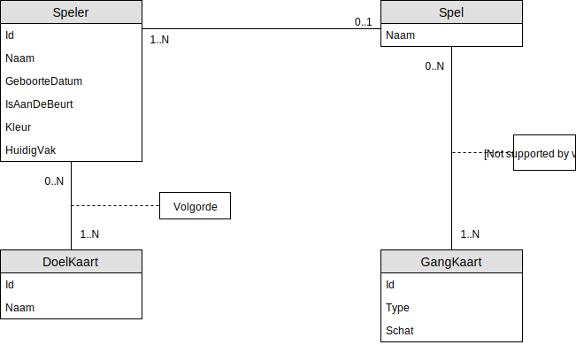

# 06 - Workshop SQL


## EERD



## Relationeel Model
- **Hoofdtabellen**
    - **Spel**(<ins>Naam</ins>)
        - IR: De `naam` van een `spel` is maximum 20 karakters lang.
    - **Doelkaart**(<ins>Id</ins>, Naam)
        - IR: Heeft als `primaire sleutel` een karakter column van 5 lang.
        - IR: De `naam` is maximum 30 karakters lang, is niet verplicht.
    - **Gangkaart** (<ins>Id</ins>, Type, Schat)
        - IR: Heeft als primaire sleutel een karakter column van 5 lang.
        - IR: Het `type` is maximum 8 karakters lang, is niet verplicht.
        - IR: De `schat` is maximum 20 karakters lang, is niet verplicht.
    - **Speler**(<ins>Id</ins>, Naam, GeboorteJaar, Kleur, HuidigVak, IsAanDeBeurt, Spelnaam)
        - IR: Heeft als primaire sleutel een automatisch gegenereerde integer.
        - IR: De `naam` is maximum 100 karakters lang, is verplicht.
        - IR: Het `geboortejaar` is een integer. 
        - IR: De kleur is een karakterwaarde van maximum 10 karakters. Maar enkel `rood` of `zwart` mag ingevoerd worden.
        - IR: Het `huidigvak` is een karakterwaarde van 20 lang en is niet verplicht.
        - IR: `IsAanDeBeurt` is een ja/neen veld.
        - IR: `Spelnaam` verwijst naar de verzameling `Spel` en is **optioneel**
- **Tussentabellen**
    - **Speler_Doelkaart**(<ins>SpelerId, KaartId</ins>, Volgorde)
        - IR: De `volgorde` is een integer. 
        - IR: `SpelerId` verwijst naar de verzameling `Speler` en is **verplicht**
        - IR: `KaartId` verwijst naar de verzameling `Doelkaart` en is **verplicht**
    - **Spel_Gangkaart**(<ins>Spelnaam, KaartId</ins>, Richting, Positie)
        - IR: De `richting` en `positie` zijn karakterwaarden van maximum 20 lang en zijn niet verplicht.. 
        - IR: `Spelnaam` verwijst naar de verzameling `Spel` en is **verplicht**
        - IR: `KaartId` verwijst naar de verzameling `GangKaart` en is **verplicht**

## Oplossingen 5 - Definiëren
1. Maak een databank met naam `WorkshopDDL`, refresh nadien je schema in MySQL Workbench zodat de databank zichtbaar is. Voer nadien het statement `USE WorkshopDDL` uit om de databank als de standaard databank actief te zetten.
    - Kan ook bereikt worden door de databank te dubbelklikken in MySQL Workbench.
    ```sql
    CREATE DATABASE WorkshopDDL;
    USE WorkshopDDL;
    ```
2. Maak de tabel `Spel` aan.
    ```sql
    CREATE TABLE IF NOT EXISTS Spel
    (
        Naam            VARCHAR(20),
        CONSTRAINT PK_Spel PRIMARY KEY(Naam)
    );
    ```
3. Maak de tabel `Doelkaart` aan.
    ```sql
    CREATE TABLE IF NOT EXISTS Doelkaart​
    (
        Id              VARCHAR(5),
        Naam            VARCHAR(30),
        CONSTRAINT PK_Doelkaart PRIMARY KEY(Id)
    );
    ```
4. Maak de tabel `Gangkaart` aan.
    ```sql
    CREATE TABLE IF NOT EXISTS Gangkaart
    (
        Id              VARCHAR(5),
        Type            VARCHAR(8),
        Schat           VARCHAR(20),
        CONSTRAINT PK_Gangkaart PRIMARY KEY(Id)
    );
    ```
5. Maak de tabel `Speler` aan.
    ```sql
    CREATE TABLE IF NOT EXISTS Speler
    (
        Id      	    INT AUTO_INCREMENT,
        Naam            VARCHAR(100) NOT NULL,
        GeboorteJaar    INT,
        Kleur           VARCHAR(10),
        Huidigvak	    VARCHAR(20),
        IsAanDeBeurt    BOOLEAN,
        Spelnaam        VARCHAR(5),
        CONSTRAINT PK_Speler PRIMARY KEY(Id),
        CONSTRAINT FK_Speler_Spel FOREIGN KEY(Spelnaam) REFERENCES Spel(Naam),
        CONSTRAINT CH_Speler_Kleuren CHECK (Kleur IN ('rood','zwart'))
    );
    ```

6. Maak de tabel `Spel_Gangkaart` aan.
    ```sql
	CREATE TABLE IF NOT EXISTS Spel_Gangkaart
	(
        Spelnaam	    VARCHAR(20),
        KaartId         VARCHAR(5),
        Richting        VARCHAR(20),
        Positie         VARCHAR(20),
        CONSTRAINT PK_Spel_Gangkaart PRIMARY KEY(Spelnaam, KaartId),
        CONSTRAINT FK_Spel_Gangkaart_Spel FOREIGN KEY(Spelnaam) REFERENCES Spel(Naam),
        CONSTRAINT FK_Spel_Gangkaart_Gangkaart FOREIGN KEY(KaartId) REFERENCES Gangkaart(Id)
	);
    ```
7. Maak de tabel `Speler_Doelkaart​` aan.
    ```sql
	CREATE TABLE IF NOT EXISTS Speler_Doelkaart​
    (
        SpelerId        INT,
        DoelId          VARCHAR(5),
        Volgorde        INT,
        CONSTRAINT PK_Speler_Doelkaart PRIMARY KEY(SpelerId, DoelId),
        CONSTRAINT FK_Speler_Doelkaart_Speler FOREIGN KEY(SpelerId) REFERENCES Speler(Id),
        CONSTRAINT FK_Speler_Doelkaart_Doelkaart FOREIGN KEY(DoelId) REFERENCES DoelKaart(Id)
	);
    ```
8. Voeg een extra kolom Email aan de Speler entiteit toe, met lengte 50.
    ```sql
    ALTER TABLE Speler
    ADD COLUMN Email VARCHAR(50);
    ```
9. Pas de kolom Email aan van de Speler naar lengte 100.
    ```sql
    ALTER TABLE Speler
    MODIFY COLUMN Email VARCHAR(100);
    ```
10. Verwijder de kolom Email van Speler.
    ```sql
    ALTER TABLE Speler
    DROP COLUMN Email;
    ```
## Oefeningen
Klik [hier](../exercises.md) om terug te gaan naar de oefeningen.
