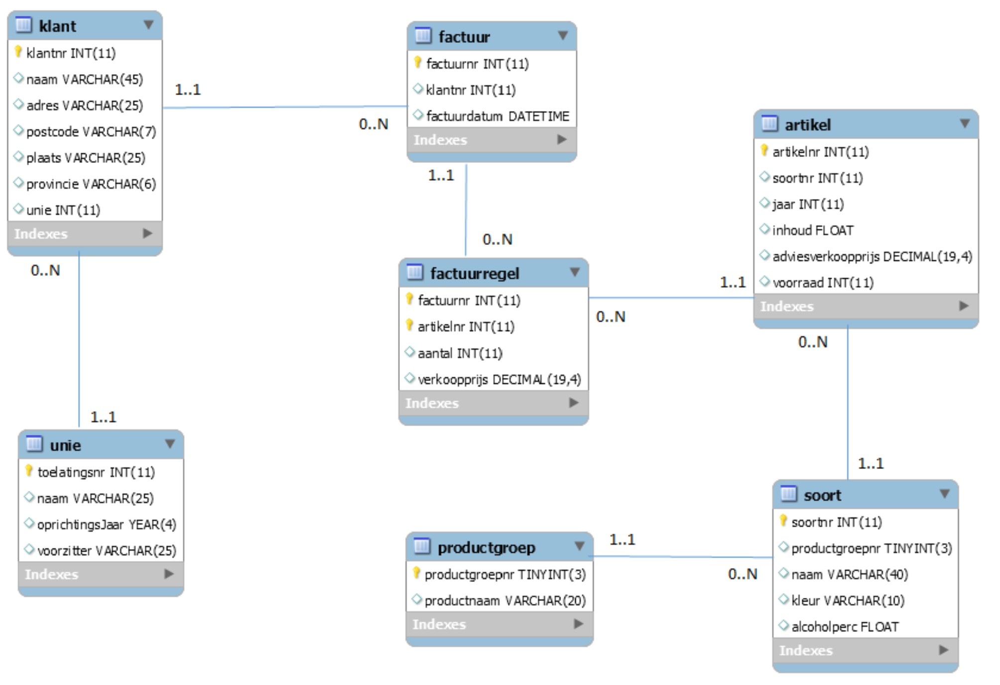

# 06 - Workshop SQL : Dranken

## Diagram

    

> Meer informatie over de databank kan je [hier](structure.md) vinden.

## Oefening 3 - Combineren

1. Tot welke unie behoort Wijnhuis Tinto? Geef de naam van de unie en het oprichtingsjaar.
    > Gentse Wijnunie, 1963
2. Aan wie is op 29 juni 2017 een factuur verstuurd? Geef naam, adres, postcode en plaats. 
    > 3 records
3. Welke whisky’s hebben een alcoholpercentage hoger dan 40? Geef productnaam, soortnummer en naam. 
    > 4 records
4. Aan wie werden één of meer flessen Saint Véran gefactureerd? Toon het factuurnummer, het klantnummer, de naam van de klant en het aantal
    > 2 records
5. Welke wijnen uit het jaar 2008 hebben we in het assortiment? Toon naam, inhoud en adviesverkoopprijs. 
    > 4 records
6. Toon alle artikelen uit de productgroepen Grappa, Cava, Gin en Sherry. 
    > 13 records
7. Welke artikelen werden verkocht onder de adviesverkoopprijs? Geef artikelnummer,soortnummer en productnaam.
    > 35 records
8. Geef het artikelnummer en het soortnummer van deze artikelen die voorkomen op een factuurregel doch geen voorraad hebben.
    > 1 record: artikelnr 10854
9. Geef een overzicht van namen van de klanten voor wie op 29 of 30 juni 2017 een factuur werd opgemaakt. Toon factuurnummer, factuurdatum en naam op volgorde van naam. 
    > 5 records,factuurnummer 173108 is de eerste
10. Welke rode wijnen kunnen geleverd worden? Toon de naam, de flesinhoud en de adviesverkoopprijs. De duurste fles moet als eerste getoond worden. 
    > 17 records, Rioja Crianza Sierra is de eerste
11. Geef een alfabetisch overzicht van de namen van alle klanten en de naam van de voorzitter van de unie waarbij ze aangesloten. Ook klanten die nog niet bij een unie zijn aangesloten moeten in het overzicht voorkomen. 
    > 17 records
12. Geef de top 3 goedkoopste wijnen (artikelnummer, jaar en adviesverkoopprijs)
    > Tip: Zoek zelf eens de `LIMIT` clause voor MySQL op.
    > artikelnummers: 10844, 10859 en 10848
13. Toon de 3 artikelen van het type 'Cava' met de grootste voorraad (artikelnummer en voorraad Dalend gesorteerd).
    > Tip: Zoek zelf eens de `LIMIT` clause voor MySQL op.
    > 3 records met voorraad tussen 177 en 20 stuks
14. Wat is de gemiddelde adviesverkoopprijs van de wijnen uit het jaar 2012? Geef een duidelijke hoofding. 
    > €35,20
15. Wat is de prijs van de duurste witte wijn?
    > €90,50
16. Toon het kleinste aantal flessen Whisky op voorraad. Geef hiervan de soortnaam. 
    > Avoca, 1
17. Van welke soorten (naam) komen er geen artikelen voor? 
    > 19 record
18. Toon het grootste aantal liter Grappa in voorraad.
    > 11,25 liter
19. Voor welk bedrag is op 17 oktober 2017 aan klanten die niet uit Gent komen gefactureerd? 
    > €347,50
20. Geef per productgroep de productnaam, het aantal artikelen en de gemiddelde, de hoogste en de laagste adviesverkoopprijs. Sorteer alfabetisch op productnaam.
    > 9 records, voor Cava met respectievelijk 4, €12,37, €5,49, €25,00
21. Geef per factuur de naam van de klant, het factuurnummer en het totale factuurbedrag. De duurste factuur moet als eerste staan. 
    > 23 records, Wijnen Lybaert staat als eerste met factuurnr 173124 en een factuurbedrag van €5100,00
22. Geef per soort rode wijn het totaal aantal flessen en het totaal aantal liter op voorraad. Toon eveneens de soortnaam. Sorteer op volgorde van soortnaam. 
    > 13 records, voor Léoville Barton is het aantal flessen 25 en het aantal liter 18,75
23. Welke unie(‘s) hebben geen leden (klanten)? 
    > 1 record Antwaarp Wijn
24. Van welke producten hebben we meer dan 100 liter in voorraad? Druk alfabetisch af.
    > 3 records: Cava, Champagne en Wijn
25. Van welke soort hebben we in oktober 2017 meer dan 10 flessen verkocht? Laat de soortnaam en het aantal flessen afdrukken op volgorde van dalend aantal flessen.
    > 1 record: Riesling Auslese met 201 flessen
26. Welke vijf artikelen zijn in aantal flessen het best verkocht in 2017? Toon artikelnummer, soortnaam en aantal flessen. 
    > 5 records

### Oplossing
Een mogelijke oplossing voor deze oefening vind je [hier](/workshops/07-SQL/solutions/dranken/exercise-3.md)
