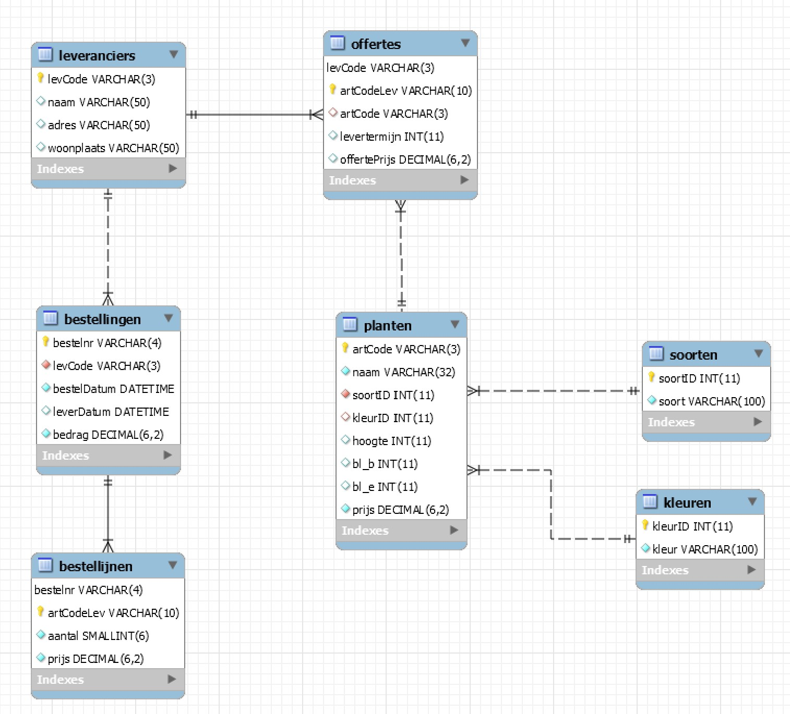

# 06 - Workshop SQL : Planten

## Diagram

    

> Meer informatie over de databank kan je [hier](structure.md) vinden.

## Oefening 1 - Raadplegen

1. Toon een alfabetische adreslijst van alle leveranciers (naam, leverancierscode, adres en
woonplaats). Sorteer op woonplaats in dalende volgorde. Bij gelijke woonplaats komen de
namen van de leveranciers in alfabetische volgorde.
 > 11 records
2. Toon de unieke leverancierscode van de leveranciers waarbij bestellingen zijn geplaatst.
 > 9 records
3. Geef een alfabetisch lijst van alle planten (naam) waarvan de naam eindigt op bloem.
 > 12 records
4. Geef een overzicht (alle gegevens) van alle leveranciers die wonen te Antwerpen, Heusden of Leuven.
 > 0 records
5. Toon de naam, artikelcode en prijs van de planten waarvan de bloei begint in april.
 > 10 records
6. Geef een overzicht van alle planten waarvan de bloeiperiode begin en/of bloeiperiode einde niet is ingevuld. Toon de naam van de planten en een aanduiding, gebruik hiervoor een case expressie en noem de kolom "bloeiperiode", de volgende aanduidingen zijn mogelijk:
    - Beginperiode niet opgegeven: indien enkel bl_b niet is ingevuld
    - Eindperiode niet opgegeven: indien enkel bl_e niet is ingevuld
    - Periodes niet opgegeven: indien beide niet ingevuld
 > 15 records
7. Geef de namen van de planten waarin het woordje boom voorkomt of waarvan de naam bestaat uit 5 posities.
 > 12 records
8. Toon naam en woonplaats van de leveranciers die niet in Lisse wonen.
 > 7 records
9. Toon naam van de planten waarvan de bloeiperiode begint tussen juni en oktober.
 > 70 records
10. Geef artikelcode en naam van de planten waarvan de naam begint met een L en eindigt met een E.
 > 4 records
11. Geef de namen van de planten waarvan de naam een spatie bevat.
 > 3 records
12. Toon de verschillende woonplaatsen (alfabetisch) van de leveranciers.
 > 4 records
13. Toon de bestelnummers van de bestellingen voor een bedrag van meer dan 250 euro die binnen de 14 dagen werden geleverd.
 > 6 records
14. Geef een alfabetisch overzicht van de plantnamen die uit maximaal 5 letters bestaan.
 > 15 records
15. Toon de naam en de hoogte van de planten die tussen de 10 en de 50 cm of de 100 en 150 cm hoog zijn. Naast de hoogte moet de tekst cm worden weergegeven.
 > 57 records

### Oplossing
Een mogelijke oplossing voor deze oefening vind je [hier](/workshops/07-SQL/solutions/planten/exercise-1.md)
